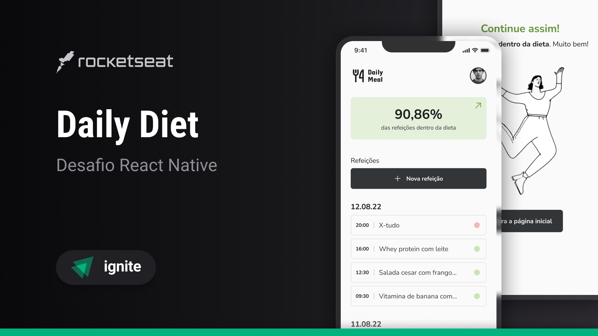

<h1 align='center'>Ignite Daily Diet API</h1>

<div align='center'>

  

  [](https://opensource.org/licenses/MIT)

  [⬅️ Voltar](../README.md)

</div>

## 📚 Sumário
- [❕ Sobre](#about)
- [📖 Instruções](#instructions)
  - [📥 Instalar](#install)
  - [🚀 Rodar Localmente](#locally)
	- [📋 Rodar Testes Unitários](#unit-tests)
- [⚡ Endpoints](#endpoints)
- [📂 Estrutura](#structure)
- [🧰 Tecnologias](#technologies)
- [📸 Prints e 🎥 Gravações](#screenshots-prints)
- [👤 Autor](#author)
- [📄 Licença](#license)

### <a id='about' style='text-decoration: none; color: inherit;'>❕ Sobre</a>
Esta é a minha implementação do desafio "Daily Diet API" do segundo módulo de Node.js do [Ignite](https://www.rocketseat.com.br/ignite), um curso intermediário e avançado de diversas linguagens de programação e tecnologias oferecido pela [Rocketseat](https://www.rocketseat.com.br/).

### <a id='instructions' style='text-decoration: none; color: inherit;'>📖 Instruções</a>
#### <a id='install' style='text-decoration: none; color: inherit;'>📥 Instalar</a>
Cole o 1º comando em um terminal aberto dentro da pasta de sua preferência para clonar o projeto
```sh
git clone https://github.com/mar-alv/ignite-daily-diet-api.git
```

Em seguida rode uma das versões do 2º comando para instalar as dependências
```sh
npm i
```
```sh
npm install
```

#### <a id='locally' style='text-decoration: none; color: inherit;'>🚀 Rodar Localmente</a>
Cole o comando em um terminal, a aplicação estará acessível através desse [link](http://localhost:5173)
```sh
npm run dev
```

#### <a id='unit-tests' style='text-decoration: none; color: inherit;'>📋 Rodar Testes Unitários</a>
Cole o comando em um terminal, eles serão executados um após o outro apontando se houve testes falhos
```sh
npm run tests
```

### <a id='endpoints' style='text-decoration: none; color: inherit;'>⚡ Endpoints</a>
Para fazer requisições ao servidor com 🥧 HTTPie diretamente do terminal, é necessário seguir o [guia de instalação](https://httpie.io/docs/cli/main-features) da CLI
#### Criar usuário
Cria um novo usuário
```sh
curl -X POST http://localhost:3001/users -h "Content-Type: application/json" -d '{"name": "mar alv","age": 30,"height": 210,"weight": 100,"sex": "masculine"}'
```

Com 🥧 HTTPie
```sh
http POST http://localhost:3001/users < httpie/create-user.json
```

Respostas
```
# Ao fazer isso com sucesso

HTTP/1.1 201 Created
Connection: keep-alive
set-cookie: sessionId=39cad374-1d58-48e3-bb3b-e63cdaf76163; Max-Age=604800; Path=/

{
    "userId": "dfb402ec-7962-4bb3-a6e2-b1d674430dbd"
}

# Ao não enviar um atributo

HTTP/1.1 400 Bad Request
Connection: keep-alive
content-type: application/json; charset=utf-8

{
    "errors": {
        "age": [
            "Required"
        ],
				...
    },
    "message": "Invalid input"
}

# Ao enviar um nome muito curto

HTTP/1.1 400 Bad Request
Connection: keep-alive
content-type: application/json; charset=utf-8

{
    "errors": {
        "name": [
            "Name must be at least 3 characters long"
        ]
    },
    "message": "Invalid input"
}

# Ao enviar uma idade abaixo de 12 anos

HTTP/1.1 400 Bad Request
Connection: keep-alive
content-type: application/json; charset=utf-8

{
    "errors": {
        "age": [
            "Age must be at least 12 years old"
        ]
    },
    "message": "Invalid input"
}

# Ao enviar uma idade acima de 100 anos

HTTP/1.1 400 Bad Request
Connection: keep-alive
content-type: application/json; charset=utf-8

{
    "errors": {
        "age": [
            "Age must be no more than 110 years old"
        ]
    },
    "message": "Invalid input"
}

# Ao enviar uma altura abaixo de 130cm

HTTP/1.1 400 Bad Request
Connection: keep-alive
content-type: application/json; charset=utf-8

{
    "errors": {
        "height": [
            "Height must be at least 130 cm"
        ]
    },
    "message": "Invalid input"
}

# Ao enviar uma altura acima de 270cm

HTTP/1.1 400 Bad Request
Connection: keep-alive
content-type: application/json; charset=utf-8

{
    "errors": {
        "height": [
            "Height must be no more than 270 cm"
        ]
    },
    "message": "Invalid input"
}

# Ao enviar um peso abaixo de 30kg

HTTP/1.1 400 Bad Request
Connection: keep-alive
content-type: application/json; charset=utf-8

{
    "errors": {
        "weight": [
            "Weight must be at least 30 kg"
        ]
    },
    "message": "Invalid input"
}

# Ao enviar um sexo inválido

HTTP/1.1 400 Bad Request
Connection: keep-alive
content-type: application/json; charset=utf-8

{
    "errors": {
        "sex": [
            "Please select either "masculine" or "feminine" as your sex"
        ]
    },
    "message": "Invalid input"
}
```

#### Buscar usuário
Retorna um usuário através do seu id
```sh
curl -X GET "http://localhost:3001/users/245f1c46-101d-471a-976f-74878e61c819" -H "Cookie: sessionId=1384df4b-bc5c-400f-9ae4-8dd841aafc3e"
```

Com 🥧 HTTPie
```sh
http GET http://localhost:3001/users/245f1c46-101d-471a-976f-74878e61c819 "Cookie:sessionId=1384df4b-bc5c-400f-9ae4-8dd841aafc3e"
```

Respostas
```
# Ao fazer isso com sucesso

HTTP/1.1 200 OK
Connection: keep-alive
content-type: application/json; charset=utf-8

{
    "user": {
        "age": 30,
        "height": 210,
        "name": "mar alv",
        "sex": "masculine",
        "weight": 100
    }
}

# Ao enviar um id inválido

HTTP/1.1 400 Bad Request
Connection: keep-alive
content-type: application/json; charset=utf-8

{
    "errors": {
        "id": [
            "Invalid user ID"
        ]
    },
    "message": "Invalid input"
}

# Ao não encontrar o usuário

HTTP/1.1 404 Not Found
Connection: keep-alive
content-type: application/json; charset=utf-8

{
    "error": "User not found"
}

# Ao não estar autorizado

HTTP/1.1 401 Unauthorized
Connection: keep-alive
content-type: application/json; charset=utf-8

{
    "error": "Unauthorized"
}
```

#### Pegar métricas
Retorna as métricas de um usuário
```sh
curl -X GET "http://localhost:3001/users/245f1c46-101d-471a-976f-74878e61c819/metrics" -H "Cookie: sessionId=1384df4b-bc5c-400f-9ae4-8dd841aafc3e"
```

Com 🥧 HTTPie
```sh
http GET http://localhost:3001/users/245f1c46-101d-471a-976f-74878e61c819/metrics "Cookie:sessionId=1384df4b-bc5c-400f-9ae4-8dd841aafc3e"
```

Respostas
```
# Ao fazer isso com sucesso

HTTP/1.1 200 OK
Connection: keep-alive
content-type: application/json; charset=utf-8

{
    "bestDietSequence": 1,
		"dietPercentage": 50,
    "platesAmount": 2,
    "platesOnDiet": 1,
    "platesOutOfDiet": 1
}

# Ao enviar um id inválido

HTTP/1.1 400 Bad Request
Connection: keep-alive
content-type: application/json; charset=utf-8

{
    "errors": {
        "id": [
            "Invalid user ID"
        ]
    },
    "message": "Invalid input"
}

# Ao não encontrar o usuário

HTTP/1.1 404 Not Found
Connection: keep-alive
content-type: application/json; charset=utf-8

{
    "error": "User not found"
}

# Ao não estar autorizado

HTTP/1.1 401 Unauthorized
Connection: keep-alive
content-type: application/json; charset=utf-8

{
    "error": "Unauthorized"
}
```

#### Criar refeição
Cria uma nova refeição para um usuário
```sh
curl -X POST http://localhost:3001/users/835fc927-94e8-4bda-be46-db2f12dca0f9/plates -h "Content-Type: application/json" -d '{"name":"Salada de Frango Grelhado","description":"Uma salada fresca com frango grelhado, folhas verdes e um vinagrete leve.","inDiet":true}'
```

Com 🥧 HTTPie
```sh
http POST http://localhost:3001/users/835fc927-94e8-4bda-be46-db2f12dca0f9/plates < httpie/create-plate.json
```

Respostas
```
# Ao fazer isso com sucesso

HTTP/1.1 201 Created
Connection: keep-alive
content-type: application/json; charset=utf-8

{
    "plateId": "8a07b00e-e396-4f03-b3f0-d2e850fc177e"
}

# Ao não enviar um atributo

HTTP/1.1 400 Bad Request
Connection: keep-alive
content-type: application/json; charset=utf-8

{
    "errors": {
        "userId": [
            "Required"
        ],
				...
    },
    "message": "Invalid input"
}

# Ao enviar um id de usuário inválido

HTTP/1.1 400 Bad Request
Connection: keep-alive
content-type: application/json; charset=utf-8

{
    "errors": {
        "userId": [
            "Invalid user ID"
        ]
    },
    "message": "Invalid input"
}

# Ao enviar um nome muito curto

HTTP/1.1 400 Bad Request
Connection: keep-alive
content-type: application/json; charset=utf-8

{
    "errors": {
        "name": [
            "Name must be at least 2 characters long"
        ]
    },
    "message": "Invalid input"
}

# Ao enviar uma especificidade inválida da refeição pertencer à dieta

HTTP/1.1 400 Bad Request
Connection: keep-alive
content-type: application/json; charset=utf-8

{
    "errors": {
        "inDiet": [
            "Please specify if the plate is on a diet."
        ]
    },
    "message": "Invalid input"
}

# Ao não estar autorizado

HTTP/1.1 401 Unauthorized
Connection: keep-alive
content-type: application/json; charset=utf-8

{
    "error": "Unauthorized"
}

# Ao não encontrar o usuário

HTTP/1.1 404 Not Found
Connection: keep-alive
content-type: application/json; charset=utf-8

{
    "error": "User not found"
}
```

#### Buscar refeições
Retorna todas as refeições adicionadas por um usuário
```sh
curl -X GET "http://localhost:3001/users/7e04dcd0-8619-4602-bbe3-d9194790ae51/plates" -H "Cookie: sessionId=1384df4b-bc5c-400f-9ae4-8dd841aafc3e"
```

Com 🥧 HTTPie
```sh
http GET http://localhost:3001/users/7e04dcd0-8619-4602-bbe3-d9194790ae51/plates "Cookie:sessionId=c0c01f92-f54b-4b1f-a294-d8876267203c; Max-Age=604800; Path=/"
```

Respostas
```
# Ao fazer isso com sucesso

HTTP/1.1 200 OK
Connection: keep-alive
content-type: application/json; charset=utf-8

{
  "plates": {
    "2024-09-28": [
      {
        "id": "1a2b3c4d-5e6f-7g8h-9i0j-1k2l3m4n5o6p",
        "name": "Salada de Frango Grelhado",
        "description": "Uma salada fresca com frango grelhado, folhas verdes e um vinagrete leve.",
        "inDiet": true,
        "createdAt": "2024-09-28T14:30:00.000Z"
      },
      {
        "id": "7h8i9j0k-1l2m-3n4o-5p6q-7r8s9t0u1v2w",
        "name": "Vitamina de Frutas",
        "description": "Uma deliciosa vitamina feita com frutas mistas.",
        "inDiet": true,
        "createdAt": "2024-09-28T15:00:00.000Z"
      }
    ],
    "2024-09-27": [
      {
        "id": "3n4o5p6q-7r8s-9t0u-1v2w-3x4y5z6a7b8c",
        "name": "Massa Primavera",
        "description": "Massa com uma variedade de vegetais frescos.",
        "inDiet": false,
        "createdAt": "2024-09-27T12:15:00.000Z"
      }
    ]
  }
}

# Ao não ter refeições adicionadas

HTTP/1.1 200 OK
Connection: keep-alive
content-type: application/json; charset=utf-8

{
    "plates": {}
}

# Ao enviar um id de usuário inválido

HTTP/1.1 400 Bad Request
Connection: keep-alive
content-type: application/json; charset=utf-8

{
    "errors": {
        "userId": [
            "Invalid user ID"
        ]
    },
    "message": "Invalid input"
}

# Ao não encontrar o usuário

HTTP/1.1 404 Not Found
Connection: keep-alive
content-type: application/json; charset=utf-8

{
    "error": "User not found"
}

# Ao não estar autorizado

HTTP/1.1 401 Unauthorized
Connection: keep-alive
content-type: application/json; charset=utf-8

{
    "error": "Unauthorized"
}
```

#### Buscar refeição
Retorna uma refeição criada por um usuário
```sh
curl -X GET "http://localhost:3001/users/7e04dcd0-8619-4602-bbe3-d9194790ae51/plates/dd2786d7-c0e7-4dd1-a435-100728774102" -H "Cookie: sessionId=1384df4b-bc5c-400f-9ae4-8dd841aafc3e"
```

com 🥧 HTTPie
```sh
http GET http://localhost:3001/users/7e04dcd0-8619-4602-bbe3-d9194790ae51/plates/dd2786d7-c0e7-4dd1-a435-100728774102 "Cookie:sessionId=c0c01f92-f54b-4b1f-a294-d8876267203c; Max-Age=604800; Path=/"
```

Respostas
```
# Ao fazer isso com sucesso

HTTP/1.1 200 OK
Connection: keep-alive
content-type: application/json; charset=utf-8

{
    "plate": {
				"createdAt": "2024-07-22 23:34:30",
				"description": "Uma salada fresca com frango grelhado, folhas verdes e um vinagrete leve.",
				"id": "dd2786d7-c0e7-4dd1-a435-100728774102",
				"inDiet": true,
				"name": "Salada de Frango Grelhado",
				"updatedAt": "2024-07-22 23:34:30"
    }
}

# Ao enviar um id de usuário inválido

HTTP/1.1 400 Bad Request
Connection: keep-alive
content-type: application/json; charset=utf-8

{
    "errors": {
        "userId": [
            "Invalid user ID"
        ]
    },
    "message": "Invalid input"
}

# Ao enviar um id de refeição inválido

HTTP/1.1 400 Bad Request
Connection: keep-alive
content-type: application/json; charset=utf-8

{
    "errors": {
        "plateId": [
            "Invalid plate ID"
        ]
    },
    "message": "Invalid input"
}

# Ao não encontrar o usuário

HTTP/1.1 404 Not Found
Connection: keep-alive
content-type: application/json; charset=utf-8

{
    "error": "User not found"
}

# Ao não encontrar a refeição

HTTP/1.1 404 Not Found
Connection: keep-alive
content-type: application/json; charset=utf-8

{
    "error": "Plate not found"
}

# Ao não estar autorizado

HTTP/1.1 401 Unauthorized
Connection: keep-alive
content-type: application/json; charset=utf-8

{
    "error": "Unauthorized"
}
```

#### Atualizar refeição
Atualiza os dados de uma refeição de um usuário
```sh
curl -X PUT http://localhost:3001/users/835fc927-94e8-4bda-be46-db2f12dca0f9/plates/2b5d459e-55c3-48a7-ac21-86dc8c1049b7  -h "Content-Type: application/json" -d '{"name":"Salada de Frango Grelhado","description":"Uma salada fresca com frango grelhado, folhas verdes e um vinagrete leve.","inDiet":true},"createdAt":"2024-07-25T00:00:00.000Z"}'
```

Com 🥧 HTTPie
```sh
http PUT http://localhost:3001/users/7e04dcd0-8619-4602-bbe3-d9194790ae51/plates/2b5d459e-55c3-48a7-ac21-86dc8c1049b7 "Cookie:sessionId=c0c01f92-f54b-4b1f-a294-d8876267203c; Max-Age=604800; Path=/" < httpie/update-plate.json
```

Respostas
```
# Ao fazer isso com sucesso

HTTP/1.1 204 No Content
Connection: keep-alive

# Ao enviar um id de usuário inválido

HTTP/1.1 400 Bad Request
Connection: keep-alive
content-type: application/json; charset=utf-8

{
    "errors": {
        "userId": [
            "Invalid user ID"
        ]
    },
    "message": "Invalid input"
}

# Ao enviar um id de refeição inválido

HTTP/1.1 400 Bad Request
Connection: keep-alive
content-type: application/json; charset=utf-8

{
    "errors": {
        "plateId": [
            "Invalid plate ID"
        ]
    },
    "message": "Invalid input"
}

# Ao enviar um nome muito curto

HTTP/1.1 400 Bad Request
Connection: keep-alive
content-type: application/json; charset=utf-8

{
    "errors": {
        "name": [
            "Name must be at least 2 characters long"
        ]
    },
    "message": "Invalid input"
}

# Ao enviar uma especificidade inválida da refeição pertencer à dieta

HTTP/1.1 400 Bad Request
Connection: keep-alive
content-type: application/json; charset=utf-8

{
    "errors": {
        "inDiet": [
            "Please specify if the plate is on a diet."
        ]
    },
    "message": "Invalid input"
}

# Ao enviar uma data no futuro

HTTP/1.1 400 Bad Request
Connection: keep-alive
content-type: application/json; charset=utf-8

{
    "errors": {
        "createdAt": [
            "The date cannot be in the future."
        ]
    },
    "message": "Invalid input"
}

# Ao não estar autorizado

HTTP/1.1 401 Unauthorized
Connection: keep-alive
content-type: application/json; charset=utf-8

{
    "error": "Unauthorized"
}

# Ao não encontrar o usuário

HTTP/1.1 404 Not Found
Connection: keep-alive
content-type: application/json; charset=utf-8

{
    "error": "User not found"
}

# Ao não encontrar a refeição

HTTP/1.1 404 Not Found
Connection: keep-alive
content-type: application/json; charset=utf-8

{
    "error": "PLate not found"
}
```

#### Remover refeição
Remove uma refeição criada por um usuário
```sh
curl -X DELETE http://localhost:3001/users/7e04dcd0-8619-4602-bbe3-d9194790ae51/plates/99a10a6e-6dbe-4223-829b-f8ed97c34ad8 -h "Content-Type: application/json"
```

Com 🥧 HTTPie
```sh
http DELETE http://localhost:3001/users/7e04dcd0-8619-4602-bbe3-d9194790ae51/plates/99a10a6e-6dbe-4223-829b-f8ed97c34ad8 "Cookie:sessionId=c0c01f92-f54b-4b1f-a294-d8876267203c; Max-Age=604800; Path=/"
```

Respostas
```
# Ao fazer isso com sucesso

HTTP/1.1 204 No Content
Connection: keep-alive

# Ao enviar um id de usuário inválido

HTTP/1.1 400 Bad Request
Connection: keep-alive
content-type: application/json; charset=utf-8

{
    "errors": {
        "userId": [
            "Invalid user ID"
        ]
    },
    "message": "Invalid input"
}

# Ao enviar um id de refeição inválido

HTTP/1.1 400 Bad Request
Connection: keep-alive
content-type: application/json; charset=utf-8

{
    "errors": {
        "plateId": [
            "Invalid plate ID"
        ]
    },
    "message": "Invalid input"
}

# Ao não encontrar o usuário

HTTP/1.1 404 Not Found
Connection: keep-alive
content-type: application/json; charset=utf-8

{
    "error": "User not found"
}

# Ao não encontrar a refeição

HTTP/1.1 404 Not Found
Connection: keep-alive
content-type: application/json; charset=utf-8

{
    "error": "Plate not found"
}

# Ao não estar autorizado

HTTP/1.1 401 Unauthorized
Connection: keep-alive
content-type: application/json; charset=utf-8

{
    "error": "Unauthorized"
}
```

#### Rota não existente
Ao tentar acessar uma rota que não existe no servidor

Resposta
```
HTTP/1.1 404 Not Found
Connection: keep-alive
content-type: application/json; charset=utf-8

{
    "error": "Not Found",
    "message": "Route POST:/route not found",
    "statusCode": 404
}
```

### <a id='structure' style='text-decoration: none; color: inherit;'>📂 Estrutura</a>
```
│ .github/
│   └── ...
│ @types/
│   └── ...
│ db/
│   ├── migrations/
│   │     └── ...
│   └── ...
│ docs/
│   └── ...
│ httpie/
│   └── ...
│ src/
│   ├── errors/
│   │     └── ...
│   ├── libs/
│   │     └── ...
│   ├── middlewares/
│   │     └── ...
│   ├── routes/
│   │     └── ...
│   └── ...
│ tests/
│   └── ...
```

### <a id='technologies' style='text-decoration: none; color: inherit;'>🧰 Technologies</a>
#### Back-end Framework
[](https://www.fastify.io/)
[](https://www.typescriptlang.org/)

#### Database
[](https://knexjs.org/)
[](https://www.sqlite.org/)

#### Testing
[](https://vitest.dev/)
[](https://jestjs.io/)

#### Utilities
[](https://day.js.org/)
[](https://github.com/motdotla/dotenv)
[](https://eslint.org/)
[](https://www.npmjs.com/package/tsx)
[](https://zod.dev/)

### <a id='screenshots-prints' style='text-decoration: none; color: inherit;'>📸 Prints e 🎥 Gravações</a>
Para uma demonstração mais longa clique aqui e curta meu post no <a href='https://www.linkedin.com/feed/update/urn:li:activity:7246141307188854784/'>LinkedIn</a>

### <a id='author' style='text-decoration: none; color: inherit;'>👤 Autor</a>
<div style='display: flex; align-items: center;'>
		
		<div>
				<strong>Marcelo Alvarez</strong>
				<br>
				<em>Front-end Developer</em><br>
				<span>"Uma citação engraçada gerada por IA aqui 😗"</span><br>
				<a href='https://www.linkedin.com/in/mar-alv'>
					
				</a>
				<a href='https://mar-alv.github.io/'>
					
				</a>
		</div>
</div>

### <a id='license' style='text-decoration: none; color: inherit;'>📄 Licença</a>
Licenciado via [MIT](../LICENSE)
